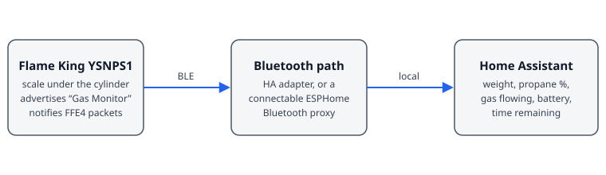

# Flame King Propane Scale for Home Assistant

[](https://github.com/agreen/flame-king-scale/actions/workflows/validate.yml)
[](https://my.home-assistant.io/redirect/hacs_repository/?owner=agreen&repository=flame-king-scale&category=integration)

A HACS-compatible Home Assistant custom integration for the stock Bluetooth
electronics in the Flame King YSNPS1 propane tank scale.

No disassembly, ESPHome scale firmware, or HX711 is required. Home Assistant
connects to the scale over Bluetooth (directly or through a connectable ESPHome
Bluetooth proxy), subscribes to the `FFE4` characteristic, and decodes the
six-byte weight packets.

## What this is

The YSNPS1 is a Bluetooth scale that sits under a propane cylinder and is
normally read through Flame King's phone app. This integration talks to that
same stock hardware directly, so the tank level, battery, and gas-use state show
up in Home Assistant with no hardware changes. It reports the *weight* the scale
measures and derives everything else from it: propane remaining comes from gross
weight minus the cylinder's empty weight, and gas flow is inferred from a
sustained downward trend, not reported by the scale.



It is a local-push integration (no cloud, no account). To protect the scale's
battery it connects only periodically or when the weight changes; see
[Battery-friendly polling](#battery-friendly-polling). Wire-level details are in
[docs/PROTOCOL.md](docs/PROTOCOL.md).

## Supported hardware

The [Flame King Smart Wireless Propane Tank Scale](https://flamekingproducts.com/products/flame-king-smart-wireless-propane-tank-scale)
(model YSNPS1). Per the manufacturer it takes two AA batteries and is intended
for 20, 30, and 40 lb propane cylinders. It advertises as `Gas Monitor`. No
photograph is bundled here because the manufacturer's page does not offer a
reusable one; see the link above or the retailer listings.

See [Other projects and models](#other-projects-and-models) for rebrands and
related work.

## Limitations

- Accuracy is that of a household scale. Factory calibration is good for
  tracking level and refill timing, not for certified measurement.
- Readings are only as fresh as the last connection (hourly by default), so
  short events are seen only when the weight change wakes the integration.
- Time remaining and consumption rate exist only during a sustained burn.
- One Bluetooth client at a time: the phone app and Home Assistant cannot both
  be connected.
- Tank-size presets cover the US 20, 30, and 40 lb cylinders (typical empty
  weights 17, 25, and 32 lb); anything else needs the stamped tare override.
  Cylinder sizes common in other regions are not preset.

## Entities

| Entity | Type | Notes |
| --- | --- | --- |
| Gross weight | Sensor (lb) | Scale reading after calibration, never below 0 |
| Propane weight | Sensor (lb) | Gross weight minus empty-cylinder weight |
| Propane remaining | Sensor (%) | Of the selected tank size, clamped to 0–100 |
| Propane consumption rate | Sensor (lb/h) | Only while gas is flowing |
| Estimated time remaining | Sensor (h) | Only during a sustained burn |
| Gas-use duration | Sensor (min) | Length of the current burn |
| Battery | Sensor (%) | Reported by the scale |
| Raw scale reading | Diagnostic sensor | Unconverted load-cell counts |
| Gas flowing | Binary sensor | Automation trigger for active use |
| Extended gas use | Binary sensor | On after the long-use time (default 2 h) |
| Tank size | Select | 20 / 30 / 40 lb |
| Request reading, Start live monitoring | Buttons | One-shot sample / hold connection open |
| Polling, flow, and tare settings | Numbers | Configurable from the device page |
| Raw zero, Raw reference, Reference weight | Numbers | Advanced calibration; disabled by default |

The scale device exposes a tank-size dropdown for propane capacity. Selecting
20 lb, 30 lb, or 40 lb supplies the matching typical empty-cylinder weight;
the cylinder's stamped `TW` is an optional override when it differs. Guided
calibration captures raw readings directly from the scale; its manual
calibration entities are disabled by default and remain available for
diagnostics.

## Units

Everything is calculated and stored in pounds, then shown in the unit you
prefer. **Configure → Tank settings → Display unit** accepts **Automatic**
(the default, which follows Home Assistant's unit system: kilograms for metric,
pounds otherwise), **Pounds**, or **Kilograms**. The setting applies to:

- Gross weight, Propane weight, and Propane consumption rate (lb/h or kg/h)
- Stamped tare override, Reference weight, and Minimum gas-flow rate
- Every weight you type during setup and guided calibration

Tank sizes are always labelled with both units (for example `20 lb (9 kg)`)
because propane cylinders are sold by nominal US pounds. A custom size is
entered in pounds. The advanced manual calibration form is a diagnostic view and
keeps its reference weight in pounds.

Changing the unit changes the unit of the affected entities. Their history in
the old unit stays as recorded.

## Battery-friendly polling

The integration does not hold the Bluetooth connection open continuously. By
default it wakes the scale every 60 minutes, collects a short sample, and
disconnects so the hardware can return to its low-power state. If the measured
weight changed by more than 1% of propane capacity, it streams updates until the
load has remained within that variance for 5 minutes, then disconnects again.
While a sustained downward trend indicates gas flow, the quiet timer keeps
resetting. The connection closes only after both the weight and detected flow
have been quiet for 5 minutes.

The regular interval, stable time, and variance are configurable from the
device page or **Configure → Polling and battery**. **Request reading** fetches
one fresh sample without changing the schedule. **Start live monitoring**
connects immediately and stays connected until the configured quiet period has
passed; pressing it again extends that window. The most recent values remain
available in Home Assistant while the scale sleeps.

The **Gas flowing** binary sensor is designed as an automation trigger. The
**Extended gas use** binary sensor turns on after the configurable long-use
time (2 hours by default), so notifications remain under the user's normal Home
Assistant notification and automation controls.

Time remaining is calculated from the measured propane weight divided by the
observed consumption rate. It is available only during a sustained burn, when
there is enough live data for an honest estimate. For comparison, the official
Flame King app assumes every appliance burns 36,000 BTU/hour; this integration
does not use that fixed assumption.

### Example automation

Notify when the tank is nearly empty or a burner has been on too long:

```yaml
automation:
  - alias: Propane tank low
    triggers:
      - trigger: numeric_state
        entity_id: sensor.gas_monitor_propane_remaining
        below: 15
    actions:
      - action: notify.notify
        data:
          message: Propane is below 15%.

  - alias: Propane burning for a long time
    triggers:
      - trigger: state
        entity_id: binary_sensor.gas_monitor_extended_gas_use
        to: "on"
    actions:
      - action: notify.notify
        data:
          message: Gas has been flowing for a long time.
```

Entity IDs follow the name you gave the scale during setup.

## Requirements

- Home Assistant 2025.1 or newer
- A Bluetooth adapter or a connectable ESPHome Bluetooth proxy in range
- Flame King YSNPS1 advertising as `Gas Monitor`

Only one Bluetooth client can connect to the scale at a time. Fully close the
Flame King app and nRF Connect before Home Assistant connects.

Home Assistant automatically chooses the nearest configured Bluetooth adapter
or connectable ESPHome proxy that can reach the scale. There is no adapter
selection field to configure or maintain.

## Install with HACS

Until this repository is included in the default HACS catalog:

[](https://my.home-assistant.io/redirect/hacs_repository/?owner=agreen&repository=flame-king-scale&category=integration)

1. In HACS, open **Integrations**.
2. Open the menu and choose **Custom repositories**.
3. Add this repository URL and choose **Integration**.
4. Install **Flame King Propane Scale** and restart Home Assistant.
5. Turn on the scale. Home Assistant should discover `Gas Monitor` automatically.

Manual installation is also supported: copy
`custom_components/flame_king_scale` into Home Assistant's
`/config/custom_components/` directory and restart.

## Set up

1. Go to **Settings → Devices & services** and accept the discovered Flame King
   scale. If discovery does not appear, choose **Add integration** and search for
   **Flame King Propane Scale**. The setup flow performs an active scan and finds
   the scale; it never asks you to type a Bluetooth address. Candidates must use
   the exact `Gas Monitor` name and, when advertised, the `FFE0` service UUID.
   On connection the integration verifies the `FFE0` service and `FFE4`
   notification characteristic before accepting scale packets. The discovery
   wizard lets you name the scale, assign its room, and choose the tank size.
   It then offers the cylinder's stamped tare weight as an optional override;
   leave it blank to use the preset empty weight for that tank size.
2. Open the integration's **Configure** dialog and choose **Tank settings**.
   Choose its propane capacity from the tank-size dropdown (normally 20 lb for
   a grill cylinder). Leave the following override blank to use the preset, or
   enter the cylinder's stamped tare weight (`TW`) when it differs.

## Calibration choices

### Factory calibration

Start with the factory calibration. It matches the conversion in the official
Flame King app and is normally adequate for tracking tank level and deciding
when to refill. The firmware can report a literal raw zero with nothing on the
platform even though the loaded conversion extrapolates to zero at raw 64; the
integration treats that as an unloaded state and clips displayed gross weight
at zero instead of showing `-0.55 lb`.

Choose **Configure → Reset factory calibration** at any time to restore those
defaults. Resetting preserves tank size, stamped-tare override, device name,
room, and polling settings.

### Guided household calibration

Use **Configure → Guided scale calibration** if you want to tune the conversion
to the individual scale. Laboratory weights are unnecessary: the goal is a
useful household estimate, not a certified measurement.

1. Remove everything and capture the unloaded state. This identifies the
   firmware's no-load value but is not used as a loaded calibration point.
2. Capture a first known load. A confirmed-empty cylinder, disconnected from
   hoses and accessories, can use its stamped `TW` automatically.
3. Capture a different second load and enter the actual total weight on the
   scale. A reference near the normal 20–40 lb working range gives a useful
   span. The integration derives both scale factor and offset from these two
   loaded measurements, so it no longer assumes Flame King's raw-64 offset.

Practical second references include two gallon water jugs, a weighed bucket of
water, a bag of pet food or rice, or exercise weights. A digital bathroom scale
is adequate: take several readings and use their average, preferably weighing
yourself with and without an awkward object and subtracting the averages. Enter
the result honestly to about `0.1 lb` (or `0.05 kg`); extra decimal places do not make a
household reference more accurate. Do not assume an overflowing nominal
five-gallon bucket contains exactly five gallons unless its total weight was
measured separately.

After calibration, use a third known load as a validation check if convenient.
If the result is not better than the factory conversion, reset to factory and
try again with a heavier or more accurately measured reference.

### Advanced manual calibration

**Advanced manual calibration** exposes the fitted raw-zero intercept and a
loaded reference point for diagnostics. Normal setup never requires copying raw
sensor readings or editing these values.

The propane calculation is:

```text
gross_lb = max(0, (raw - raw_zero) × reference_weight_lb / (raw_reference - raw_zero))
propane_lb = max(0, gross_lb - tare_lb)
propane_percent = propane_lb / capacity_lb × 100
```

Percentage is clamped to 0–100%. Raw scale readings remain available for
troubleshooting even when a below-zero converted gross weight is displayed as
zero.

## Protocol

The scale advertises as `Gas Monitor` and notifies six-byte packets
(`AA 01 LL HH BB CC`: raw little-endian load, battery %, XOR checksum) on
characteristic `FFE4` of service `FFE0`. The official app's factory conversion is
`gross_kg = (raw - 64) / 256`, which this integration uses as its default.

Full packet layout, worked examples, the raw-zero quirk, the connection policy,
and a list of what is still unverified are in
[docs/PROTOCOL.md](docs/PROTOCOL.md).

## Troubleshooting

- If the scale is unavailable, disconnect the official app and nRF Connect.
- If discovery works but connection does not, verify that your ESPHome Bluetooth
  proxy has `active: true` and available connection slots.
- If raw readings update but pounds are wrong, repeat the two-point calibration
  with a heavier known weight.
- If the raw value remains zero, ensure the scale is awake and the load is heavy
  enough to overcome its mechanical dead zone.

## Reporting a problem

Open an issue at <https://github.com/agreen/flame-king-scale/issues> and include:

1. Your Home Assistant version and how the scale is reached (local adapter or
   which ESPHome proxy).
2. **Settings → Devices & services → Flame King Propane Scale → ⋮ → Download
   diagnostics**. It redacts the Bluetooth address and includes the consecutive
   failure count and last error.
3. Debug logs covering a few poll cycles. Add this to `configuration.yaml`,
   restart, and reproduce:

   ```yaml
   logger:
     logs:
       custom_components.flame_king_scale: debug
   ```

The first failed connection is logged at warning level with the reason; further
repeats stay at debug until communication is restored.

## Development

```bash
python3.13 -m venv .venv && . .venv/bin/activate
pip install -r requirements_test.txt
ruff check . && ruff format --check .
pytest
```

Tests cover the protocol decoder, polling and usage logic, discovery matching,
unit conversion, the Bluetooth session loop (against a fake BLE client), the
setup and options flows, and the entities. CI runs lint, format, and tests, plus
HACS and hassfest validation. The brand icons under
`custom_components/flame_king_scale/brand/` use Home Assistant's required
`icon.png` / `icon@2x.png` names.

`monitor/` is a separate Windows tool for capturing advertisements and packets
when investigating the hardware; see [monitor/README.md](monitor/README.md).
Changes are recorded in [CHANGELOG.md](CHANGELOG.md).

## Other projects and models

Related work on this scale and similar hardware, none of which is affiliated
with this project:

- [mmiller7/ESPHome-Mod-Flame-King-Propane-Scale](https://github.com/mmiller7/ESPHome-Mod-Flame-King-Propane-Scale)
  replaces the YSN-PS1's electronics with an ESPHome (ESP8266) board. Its teardown
  notes on the hardware (three load cells, a separate Bluetooth radio and
  microcontroller, load-cell drift with temperature) are worth reading if you
  want to go beyond the stock electronics. This integration needs no
  modification.
- [Hackaday project 185701](https://hackaday.io/project/185701) rebuilds the
  scale's internals with its own Bluetooth app.
- [Senso4s BLE](https://tomevault.io/tome/ksanislo/senso4s_ble) is a Home
  Assistant integration for a different kind of gas-cylinder level sensor, useful
  as a comparison for decoding Bluetooth gas-level devices.

The Flame King scale is also sold under other retailer listings. If you have a
verifiably compatible model or rebrand (or one that turns out not to work),
please let me know by [opening an issue](https://github.com/agreen/flame-king-scale/issues)
with its name, a link to the listing, and what its Bluetooth advertisement shows.

## Credits

Protocol research builds on public reverse-engineering work by Alex Whittemore
and Althost2. This project is not affiliated with Flame King.

## License

MIT
